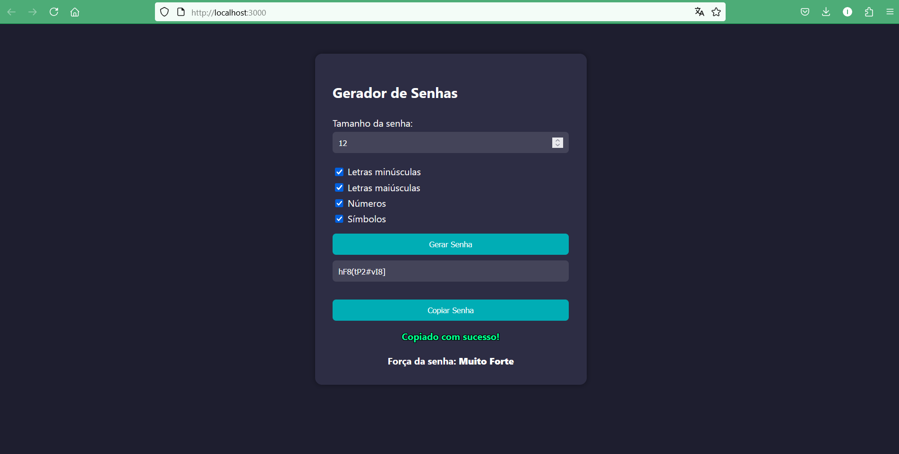

# 🔐 Gerador de Senhas Seguras - React

Um gerador de senhas personalizável desenvolvido com **React** e **CSS puro**, criado com foco em segurança, usabilidade e aprendizado prático.  
Você escolhe o tamanho da senha, os tipos de caracteres e copia com um clique.

## 🚀 Funcionalidades

- ✅ Geração de senhas seguras e aleatórias
- ✅ Opções de personalização:
  - Letras minúsculas
  - Letras maiúsculas
  - Números
  - Símbolos
- ✅ Definição do tamanho da senha
- ✅ Cópia da senha para a área de transferência
- ✅ Mensagem de feedback ao copiar
- ✅ Indicador de força da senha
- ✅ Interface responsiva e intuitiva

## 🧠 Tecnologias Utilizadas

- [React](https://reactjs.org/) (Create React App)
- JavaScript moderno (ES6+)
- HTML5 + JSX
- CSS3 (estilização própria, sem bibliotecas externas)

## 📂 Estrutura do Projeto
src/
├── App.js
├── index.js
├── PasswordGenerator.jsx
├── PasswordGenerator.css

## 📦 Como Executar Localmente
1. Clone o repositório:
git clone https://github.com/IagoAlves2/gerador-senhas-react.git

2. Instale as dependências:
npm install

3. Execute o projeto:
npm start

4. Acesse no navegador:
http://localhost:3000

🌐 Publicação

Este projeto pode ser facilmente publicado usando:

    Vercel

    Netlify

    Ou qualquer serviço de hospedagem para React apps

📸 Preview

👨‍💻 Autor

Desenvolvido por Iago Alves, oficial do Exército e estudante dedicado à transição de carreira para a área de TI.
Projeto criado como parte de sua prática em React e construção de portfólio.

GitHub: https://github.com/IagoAlves2

Este projeto não possui licença no momento. Sinta-se à vontade para estudá-lo, aprender com ele e se inspirar.
